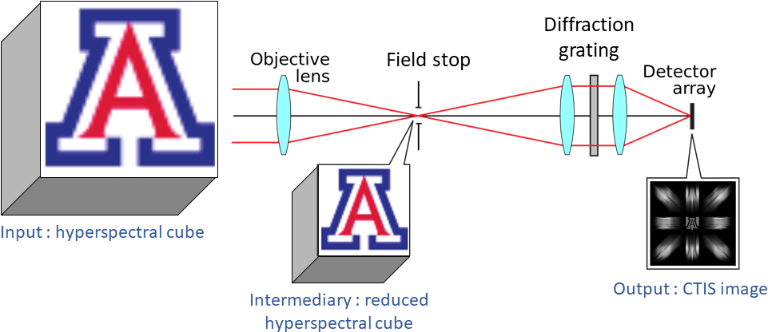
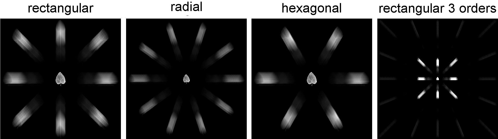

# ctis-simulator
Simulate a Computed Tomography Imaging Spectrometer image from a 3D hyperspectral cube.

Input : A 3D image (preferably in the form of a .tiff file) representing a hyperspectral cube of an object.
Output : A 2D image (.png) representing the CTIS acquisition of that object.

<br/>



(image modified from Wikipedia)
<br/>

___
### Usage 
MWE :  
```
python main.py -I <input directory with hyperspectral cubes> -O <output directory for CTIS images>  
```
to try it out with the example cube from this repo :  
```
python main.py -I ressources/input_cubes_small -O .
```

Customization :  

   
* Change CTIS geometries with ```--grating```, ```--min_wavelength```, ```--max_wavelength```.
 
* Change spectral sensitivity of the sensor by providing a csv defining it. An example is at [ressources/spectral_sensitivity.csv](ressources/spectral_sensitivity.csv). 
* Chose whether you're providing a hyperspectral cube or the intermediary cube directly with ```--field_stop```
* The CTIS action can be modelized by a matrix S between the reduced hyperspectral cube and the CTIS image. This matrix can be computed with ```--compute_system_matrix```. It can be useful for reconstruction approaches. Note however that the computation time can be quite long.

___
### Bibliography 

* The CTIS system is from :  *Computed-tomography imaging spectrometer: experimental calibration and reconstruction results*, Descour et al, Applied Optics (1995) 
([pdf](https://pdfs.semanticscholar.org/c886/1e02bbcb5a513927361b31223c7618d99dac.pdf))  
* The diffraction grating geometries we implemented come from : *Maximizing the resolution of a CTIS instrument*, Hagen et al, Imaging Spectrometry (2006) ([pdf](https://www.researchgate.net/profile/Nathan_Hagen/publication/228476247_Maximizing_the_resolution_of_a_CTIS_instrument_-_art_no_63020L/links/00b4952b33e7c72e1e000000/Maximizing-the-resolution-of-a-CTIS-instrument-art-no-63020L.pdf))
